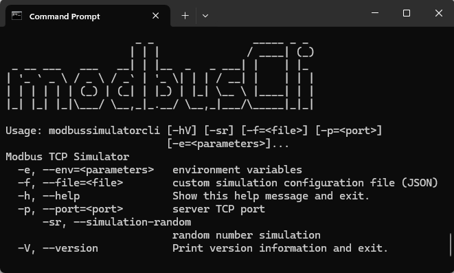

# Modbus Simulator CLI

[](https://sonarcloud.io/summary/new_code?id=paulorb_modbus-simulator-cli)
[](https://sonarcloud.io/summary/new_code?id=paulorb_modbus-simulator-cli)
[](https://sonarcloud.io/summary/new_code?id=paulorb_modbus-simulator-cli)
[](https://sonarcloud.io/summary/new_code?id=paulorb_modbus-simulator-cli)


Modbus simulator CLI is a high-performance modbus TCP server with customizable simulation

Please see the [project website](https://paulorb.github.io/modbus-simulator-cli/) for documentation



## Features
* High performance TCP Server
* 100% Kotlin code - JVM (Multiplatform)
* Ability to associate memory registers with symbols (variable names)
* Ability to create custom simulation which can during runtime set, clear variables, execute math operations over registers, deal with specific timing requirements
* Available as CLI tool or as docker image

## Registers
The table below shows the supported registers and which datatype
and simulation operation can be performed for each register.

| Register               | Datatype       | Operations                                  |
|------------------------|----------------|---------------------------------------------|
| Coils (0x)             | BOOL           | Set, IfEqual                                |
| Input register (1x)    | BOOL           | Set, IfEqual                                |
| Discrete Input (3x)    | INT16          | Set, Add, Sub, Random, Linear, Csv, IfEqual |
| Holding Registers (4x) | INT16, FLOAT32 | Set, Add, Sub, Random, Linear, Csv, IfEqual |

## Quick Start
1. Compile with gradle and generate fat Jar

```shell
./gradlew shadowJar
```
 2. Run it with "-sr" argument which is the most basic simulation, consisting in generating random values each time a read operation is performed.

```shell
java -jar build/libs/modbus-simulator-cli-1.0-SNAPSHOT-all.jar -sr
```
For customization options check [full documentation](https://paulorb.github.io/modbus-simulator-cli/)

## Quick Start (for Docker)

1. Pull the Modbus Simulator

```
docker pull paulorb/modbus-simulator-cli
```

2. Run the Modbus Simulator

```
docker run --rm -p 5002:5002 paulorb/modbus-simulator-cli -sr
```

## Author
Contact me on [](https://www.linkedin.com/in/paulo-roberto-balbino/)